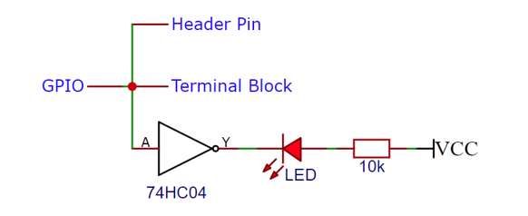
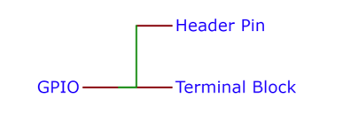
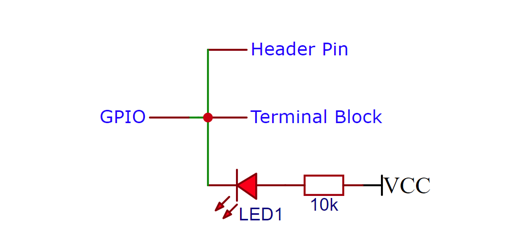
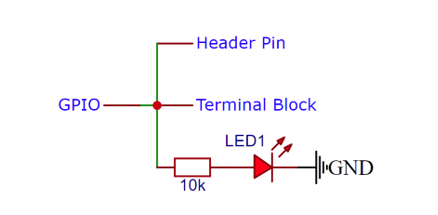
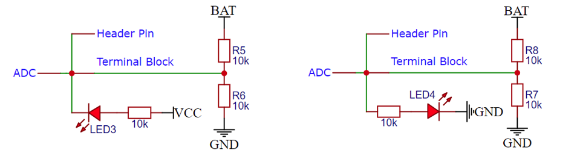
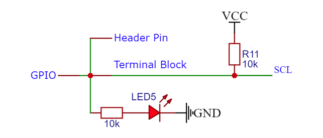
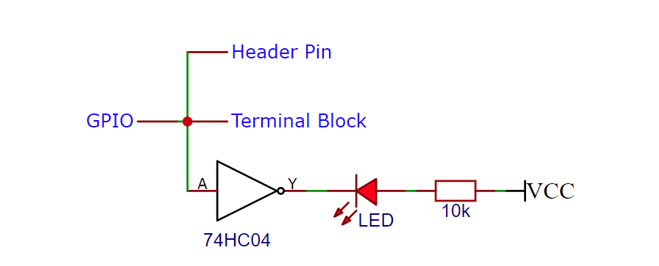

##############################################################################
Design Explanation
##############################################################################

Why We Designed the Freenove Breakout Board This Way 

This document explains why the onboard pins do not use pull-down circuit but use buffers instead.

The figure below illustrates a typical IO breakout design for the Freenove Breakout Board.

A breakdown of our product design thought process is provided below.

Initially, our goal was simply to achieve a more convenient wiring setup, where the motherboard's GPIO would connect directly to KF128 terminal blocks, as illustrated in the following diagram:

However, this approach sacrifices the functionality of the original pin header, as female jumper wires can no longer be directly plugged into the pins. Therefore, we added pin headers to restore the original motherboard pin layout, as illustrated in the diagram below:

Thus far, we have successfully routed the motherboard's GPIOs without altering their states.

Typically, a GPIO pin can be in one of three states: output high, output low, or floating/high-impedance (indeterminate/random level).  

To indicate the GPIO state with an LED, we immediately thought of two possible implementations:  

Method 1:

In this case, the LED is off when the GPIO is at a high level, and on when it is at a low level.

Method 2:

In this case, the LED is on when the GPIO is at a high level, and off when it is at a low level.

However, both methods share a critical flaw: they alter the original state of the GPIOs, forcing them into either a pull-up or pull-down configuration and thereby :combo:`red font-bolder:eliminating the floating (high-impedance) state.`

This can be critical in certain scenarios, for example:  

1. ADC voltage sampling, as shown in the following diagram.

In either case, the voltage sampled by the ADC will become inaccurate.

2. For devices that require open-drain output—such as I2C, which typically relies on pull-up resistors—this can create a resistive voltage divider, preventing the circuit from functioning properly.

3. As to ESP32-series development boards, they include strapping pins. The state of these strapping pins during board power-up determines whether the board can function normally.

.. table::
    :align: center
    :class: zebra zebra-theme-blue text-center
    
    +---------------+-----------------------+-----------+
    | ESP32                                             |
    +===============+=======================+===========+
    | Strapping Pin | Default Configuration | Bit Value |
    +---------------+-----------------------+-----------+
    | GPIO0         | Weak Pull-up          | 1         |
    +---------------+-----------------------+-----------+
    | GPIO2         | Weak Pull-down        | 0         |
    +---------------+-----------------------+-----------+
    | GPIO5         | Weak Pull-up          | 1         |
    +---------------+-----------------------+-----------+
    | GPIO12        | Weak Pull-down        | 0         |
    +---------------+-----------------------+-----------+
    | GPIO15        | Weak Pull-up          | 1         |
    +---------------+-----------------------+-----------+

.. table::
    :align: center
    :class: zebra zebra-theme-blue text-center

    +---------------+-----------------------+-----------+
    | ESP32S3                                           |
    +===============+=======================+===========+
    | Strapping Pin | Default Configuration | Bit Value |
    +---------------+-----------------------+-----------+
    | GPIO0         | Weak pull-up          | 1         |
    +---------------+-----------------------+-----------+
    | GPIO3         | Floating              | \-        |
    +---------------+-----------------------+-----------+
    | GPIO45        | Weak pull-down        | 0         |
    +---------------+-----------------------+-----------+
    | GPIO46        | Weak pull-down        | 0         |
    +---------------+-----------------------+-----------+

If the original design were maintained, it would interfere with the board's power on state. 

Therefore, to avoid disrupting the original GPIO state, we added a buffer to isolate such interference, as shown in the following diagram.

In this design, the problem described above is perfectly resolved: the LED lights up when the GPIO output is high, turns off when it is low, and flickers when the GPIO is in a floating state.

However, some users consider the flickering to be an abnormal indication—which is actually not the case. The flickering accurately reflects the true floating/high-impedance state of the GPIO! If a steady LED state is preferred, a definite high or low level must be assigned to each IO pin.