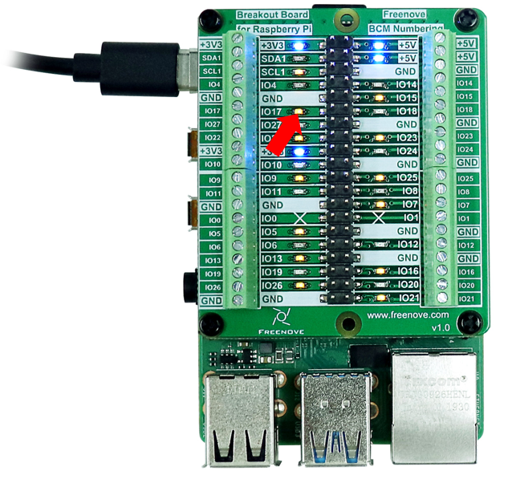
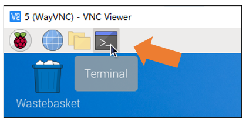
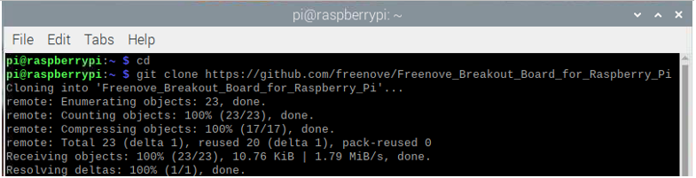
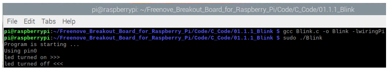
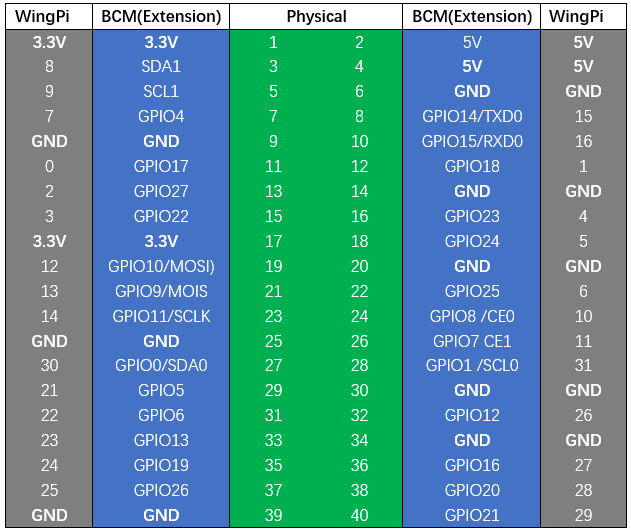
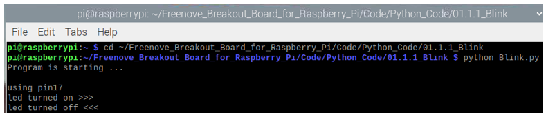
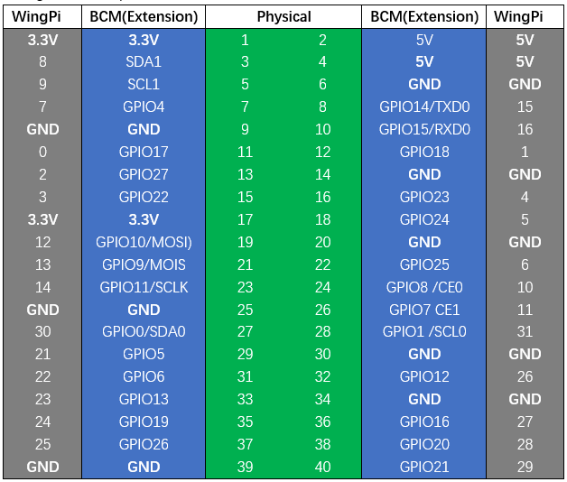

##############################################################################
Project Example
##############################################################################

LED Blink
********************************

We will make the LED indicator of GPIO 17 blink.

Geting the Code 
*********************************

Run following commands in terminal:

.. code-block:: console
    
    cd
    git clone https://github.com/freenove/Freenove_Breakout_Board_for_Raspberry_Pi

Run the Code
**********************************

C Code 01.1.1 Blink
=================================

If you have any concerns, please contact us via: support@freenove.com

1.	If you did not update wiring pi, please execute following commands one by one.

.. code-block:: console
    
    sudo apt-get update
    git clone https://github.com/WiringPi/WiringPi
    cd WiringPi
    ./build

2.	Use cd command to enter 01.1.1_Blink directory of C code.

.. code-block:: console
    
    cd ~/Freenove_Breakout_Board_for_Raspberry_Pi/Code/C_Code/01.1.1_Blink

3.	Use the following command to compile the code "Blink.c" and generate executable file "Blink".

**"l" of "lwiringPi" is low case of "L".**

.. code-block:: console
    
    gcc Blink.c -o Blink -lwiringPi

4.	Then run the generated file "blink".

.. code-block:: console
    
    ./Blink

Now your LED should start blinking! 

You can press “Ctrl+C” to end the program. The following is the program code:

.. code-block:: c
    :linenos:

    #include <wiringPi.h>
    #include <stdio.h>

    #define  ledPin    17  //define the led pin number

    void main(void)
    {	
        printf("Program is starting ... \n");
        
        wiringPiSetupGpio();    //Initialize wiringPi. Use BCM Number.
        
        pinMode(ledPin, OUTPUT);//Set the pin mode
        printf("Using pin%d\n",%ledPin);	//Output information on terminal
        while(1){
            digitalWrite(ledPin, HIGH);  //Make GPIO output HIGH level
            printf("led turned on >>>\n");		//Output information on terminal
            delay(1000);						//Wait for 1 second
            digitalWrite(ledPin, LOW);  //Make GPIO output LOW level
            printf("led turned off <<<\n");		//Output information on terminal
            delay(1000);						//Wait for 1 second
        }
    }

In the code above, the configuration function for GPIO is shown below as: 

.. py:function:: void pinMode(int pin, int mode);	

    This sets the mode of a pin to either INPUT, OUTPUT, PWM_OUTPUT or GPIO_CLOCK. Note that only wiringPi pin 1 (BCM_GPIO 18) supports PWM output and only wiringPi pin 7 (BCM_GPIO 4) supports CLOCK output modes.

    This function has no effect when in Sys mode. If you need to change the pin mode, then you can do it with the gpio program in a script before you start your program 

.. py:function:: void digitalWrite (int pin, int value);	

    Writes the value HIGH or LOW (1 or 0) to the given pin, which must have been previously set as an output.

GPIO connected to ledPin in the circuit is GPIO17 and GPIO17 is defined as 0 in the wiringPi numbering. You can refer to the corresponding table.

.. code-block:: c
    :linenos:

    #define  ledPin    17 //define the led pin number

GPIO Numbering Relationship

In the main function main(), initialize wiringPi first.

.. code-block:: c
    :linenos:

    wiringPiSetupGpio();    //Initialize wiringPi. Use BCM Number.

After the wiringPi is initialized successfully, you can set the ledPin to output mode and then enter the while loop, which is an endless loop (a while loop). That is, the program will always be executed in this cycle, unless it is ended because of external factors. In this loop, use digitalWrite (ledPin, HIGH) to make ledPin output high level, then LED turns ON. After a period of time delay, use digitalWrite(ledPin, LOW) to make ledPin output low level, then LED turns OFF, which is followed by a delay. Repeat the loop, then LED will start blinking.

.. code-block:: c
    :linenos:

    pinMode(ledPin, OUTPUT);//Set the pin mode
	printf("Using pin%d\n",%ledPin);	//Output information on terminal
	while(1){
		digitalWrite(ledPin, HIGH);  //Make GPIO output HIGH level
		printf("led turned on >>>\n");		//Output information on terminal
		delay(1000);						//Wait for 1 second
		digitalWrite(ledPin, LOW);  //Make GPIO output LOW level
		printf("led turned off <<<\n");		//Output information on terminal
		delay(1000);						//Wait for 1 second
	}

Python Code 01.1.1 Blink
=================================

Now, we will use Python language to make a LED blink. 

If you have any concerns, please contact us via: support@freenove.com

1.	Use cd command to enter 01.1.1_Blink directory of Python code.

    .. code-block:: console
        :linenos:

        cd ~/Freenove_Breakout_Board_for_Raspberry_Pi/Code/Python_Code/01.1.1_Blink

2.	Use python command to execute python code blink.py.

    .. code-block:: console
        :linenos:

        python Blink.py

The LED starts blinking.

You can press “Ctrl+C” to end the program. The following is the program code:

.. code-block:: python
    :linenos:

    from gpiozero import LED
    from time import sleep

    led = LED(17)           # define LED pin according to BCM Numbering
    '''
    # pins numbering, the following lines are all equivalent
    led = LED(17)           # BCM
    led = LED("GPIO17")     # BCM
    led = LED("BCM17")      # BCM
    led = LED("BOARD11")    # BOARD
    led = LED("WPI0")       # WiringPi
    led = LED("J8:11")      # BOARD
    '''

    def loop():
        while True:
            led.on()    # turn on LED
            print ('led turned on >>>')  # print message on terminal
            sleep(1)    # wait 1 second
            led.off()   # turn off LED 
            print ('led turned off <<<') # print message on terminal
            sleep(1)    # wait 1 second

    if __name__ == '__main__':    # Program entrance
        print ('Program is starting ... \n')
        try:
            loop()
        except KeyboardInterrupt:  # Press ctrl-c to end the program.
            print("Ending program")
        finally:
            led.close()

In Python, libraries and functions used in a script must be imported by name at the top of the file, with

the exception of the functions built into Python by default.

For example, to use the LED interface from GPIO Zero, it should be explicitly imported:

.. code-block:: python
    :linenos:

    from gpiozero import LED

Now LEDis available directly in your script:

.. code-block:: python
    :linenos:

    led = LED(17)           # define LED pin according to BCM Numbering
    #led = LED("J8:11")     # BOARD Numbering

Alternatively, the whole GPIO Zero library can be imported:

.. code-block:: python
    :linenos:

    import gpiozero

In this case, all references to items within GPIO Zero must be prefixed: 

.. code-block:: python
    :linenos:

    led = gpiozero.LED(17)           # define LED pin according to BCM Numbering
    #led = gpiozero.LED("J8:11")     # BOARD Numbering

In loop(), there is a while loop, which is an endless loop (a while loop). That is, the program will always be executed in this loop, unless it is ended because of external factors. In this loop, set ledPin output high level, then the LED turns ON. After a period of time delay, set ledPin output low level, then the LED turns OFF, which is followed by a delay. Repeat the loop, then LED will start blinking. 

.. code-block:: python
    :linenos:

    def loop():
        while True:
            GPIO.output(ledPin, GPIO.HIGH)  # make ledPin output HIGH level to turn on led
            print ('led turned on >>>')		# print information on terminal
            time.sleep(1)					# Wait for 1 second
            GPIO.output(ledPin, GPIO.LOW)   # make ledPin output LOW level to turn off led
            print ('led turned off <<<')
            time.sleep(1)					# Wait for 1 second
        
Reference
--------------------------

About GPIO Zero:

.. py:function:: GPIO Zero	

    A simple interface to GPIO devices with Raspberry Pi, Using the GPIO Zero library makes it easy to get started with controlling GPIO devices with Python. The library is comprehensively documented at 
    
    https://gpiozero.readthedocs.io/en/stable/

    https://github.com/gpiozero/gpiozero

For more information about the methods used by the LED class in the GPIO Zero library,please refer to:

https://gpiozero.readthedocs.io/en/stable/api_output.html#led

For more information about the methods used by the DigitalOutputDevice class in the GPIO Zero 

library,please refer to:

https://gpiozero.readthedocs.io/en/stable/api_output.html#digitaloutputdevice 

“import time” time is a module of python.

https://docs.python.org/2/library/time.html?highlight=time%20time#module-time

GPIO Numbering Relationship

This library uses Broadcom (BCM) pin numbering for the GPIO pins, as opposed to physical (BOARD)
numbering. Unlike in the RPi.GPIO library, this is not configurable. However, translation from other
schemes can be used by providing prefixes to pin numbers (see below).

Any pin marked “GPIO” in the diagram below can be used as a pin number. For example, if an LED
was attached to “GPIO17” you would specify the pin number as 17 rather than 11:

If you wish to use physical (BOARD) numbering you can specify the pin number as “BOARD11”. If you
are familiar with the wiringPi pin numbers (another physical layout) you could use “WPI0” instead.

Finally, you can specify pins as “header:number”, e.g. “J8:11” meaning physical pin 11 on header J8
(the GPIO header on modern Pis). Hence, the following lines are all equivalent:

.. code-block:: python
    :linenos:
    
    led = LED(17)
    led = LED("GPIO17")
    led = LED("BCM17")
    led = LED("BOARD11")
    led = LED("WPI0")
    led = LED("J8:11")

Note that these alternate schemes are merely translations. If you request the state of a device on the
command line, the associated pin number will always be reported in the Broadcom (BCM) scheme:

.. code-block:: python
    :linenos:
    
        led = LED("BOARD11")
        led
    <gpiozero.LED object on pin GPIO17, active_high=True, is_active=False>

In gpiozero, at the end of your script, cleanup is run automatically, restoring your GPIO pins to the state they were found.To explicitly close a connection to a pin, you can manually call the close() method on a device object:

.. code-block:: python
    :linenos:
    
        led = LED(17)
        led.on()
        led
    <gpiozero.LED object on pin GPIO17, active_high=True, is_active=True>
        led.close()
        led
    <gpiozero.LED object closed>

This means that you can reuse the pin for another device, and that despite turning the LED on (and hence, the pin high), after calling close() it is restored to its previous state (LED off, pin low).

In this tutorial, most projects have added an active run cleanup program to restore the GPIO pin to the found default state.